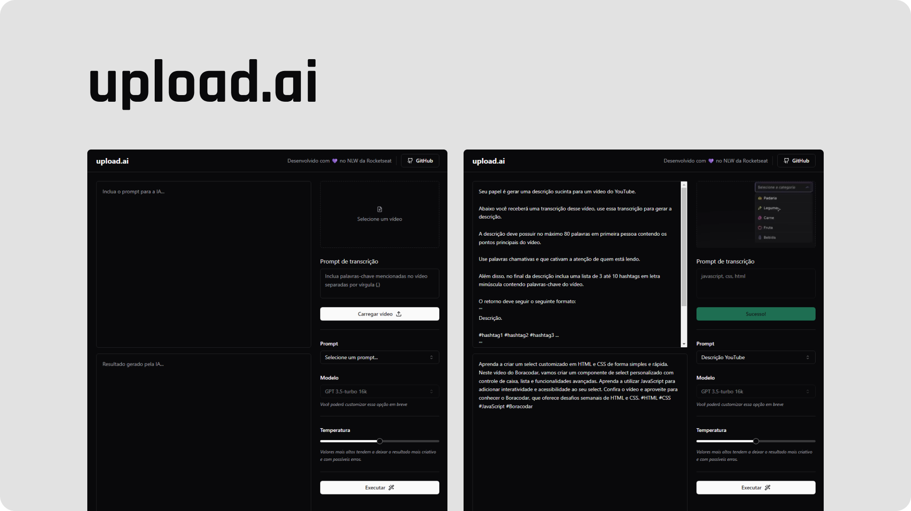

<h1 align="center">upload.ai</h1>

<div align="center">

[](https://www.linkedin.com/in/guilhermesandi/)

<p align="center">
    
</p>

</div>

<br>

## ✨ Technologies

-   [ ] React
-   [ ] Typescript
-   [ ] Vite
-   [ ] Tailwind CSS
-   [ ] Radix UI
-   [ ] shadcn/ui
-   [ ] ffmpeg.wasm
-   [ ] Vercel AI SDK

## 🚀 How to use

```sh
# Clone this repository
git clone https://github.com/guilhermesandi/upload-ai-web

# Go to the root directory of the repository
cd upload-ai-web

# Install the dependencies
npm install

# Start the application
npm run dev
```

Open [http://localhost:5173](http://localhost:5173) with your browser to see the result.
